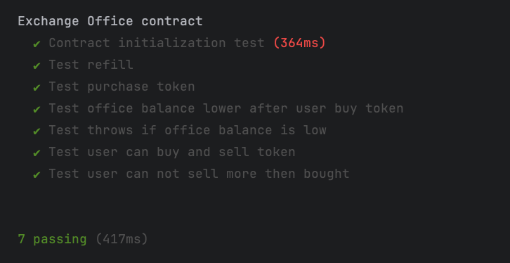
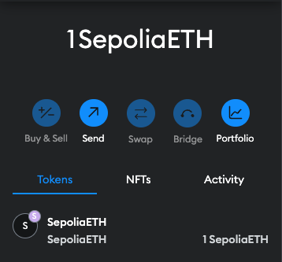

# Exchange Office using Solidity

## Exchange office functionality

* constructor
  * _exchangeRate: Exchange rate
* getOfficeBalance: Retrieves office's balance
* getFakeBalance: Fetches user's balance
* purchaseFakeToken: Buys tokens with Ether
* refill(amount): Adds fake tokens to office
  * amount: The amount of fake tokens for refill.
* sellFakeToken(amount): Sells Fake Tokens for ETH
  * amount: The amount of fake tokens the user wants to sell.
* withdrawFakeToken(amount): Withdraw Fake Tokens for ETH
  * amount: The amount of ETH the owner wants to withdraw.
## How to test?

```bash
yarn install
npx hardhat compile
npx hardhat test
```



## How to deploy?
First, to check create a `.env` file in the root directory, and initialize `API_URL` and `PRIVATE_KEY`:

```dotenv
API_URL = "https://eth-sepolia.g.alchemy.com/v2/your-api-key"
PRIVATE_KEY = "your-metamask-private-key"
```

Then you need to compile them by

```bash
npx hardhat compile
npx hardhat run scripts/deploy.js --network sepolia
```

I was unable to deploy, due to "ProviderError: insufficient funds for gas * price + value".
I'm unsure as to why this is happening (I have 1 ETH).
To check, you need to uncomment `module.exports` in `hardhat.config.js`.

